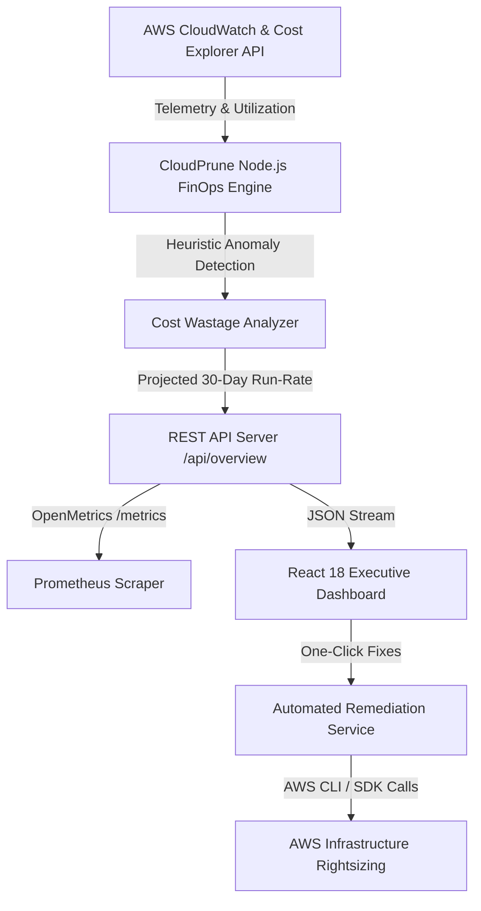

# 💵 CloudPrune — Enterprise AWS FinOps & Cost Optimization Engine

[](https://www.typescriptlang.org/)
[](https://reactjs.org/)
[](https://aws.amazon.com/)
[](https://www.terraform.io/)
[](https://prometheus.io/)
[](https://www.docker.com/)

**CloudPrune** is an automated AWS FinOps and cloud cost intelligence platform. It continuously audits cloud environments, detects idle and overprovisioned infrastructure (EC2, RDS, EBS, S3, NAT Gateways), calculates anomaly spikes, and provides one-click remediation recipes to reduce monthly AWS bills by **30% to 45%**.

---

## 🏗️ Architecture Overview



---

## ⚡ Key Capabilities & ROI

1. **Autonomous Waste Detection**:
   - Identifies oversized EC2 instances with <10% CPU utilization.
   - Detects idle staging/dev RDS databases receiving zero queries.
   - Flags unattached EBS volumes and unassociated Elastic IPs incurring hourly penalties.
   - Audits stale S3 buckets for Glacier Instant Retrieval lifecycle transitions.
2. **Real-Time Cost Anomaly Spikes**:
   - Pinpoints unexpected billing spikes (e.g. recursive Lambda triggers, rogue NAT Gateway data transfers).
3. **Interactive FinOps Savings Simulator**:
   - Real-time parameter sliders modeling non-prod weekend shutdowns, GP2-to-GP3 storage migrations, and Spot instance adoption.
4. **Exportable Remediation Recipes**:
   - Ready-to-copy AWS CLI commands and automated API triggers.

---

## 🚀 Quickstart (Docker Compose)

Launch the full stack (Node.js Backend, React Frontend, and Prometheus) locally in seconds:

```bash
# Clone the repository
git clone https://github.com/your-username/cloudprune.git
cd cloudprune

# Start all microservices
docker-compose up --build -d
```

- **Frontend Dashboard:** [http://localhost:3001](http://localhost:3001)
- **Backend API:** [http://localhost:4000/api/overview](http://localhost:4000/api/overview)
- **Prometheus Metrics:** [http://localhost:4000/metrics](http://localhost:4000/metrics)

---

## 🛠️ Tech Stack

- **Frontend:** React 18, Vite, TypeScript, Tailwind CSS, Recharts, Lucide Icons
- **Backend:** Node.js 20, TypeScript, Express, prom-client (OpenMetrics)
- **Cloud & IaC:** AWS IAM Roles, CloudWatch Alarms, Terraform IaC
- **Containerization:** Multi-Stage Dockerfiles (Node Alpine + Nginx Alpine)

---

## 📄 License
MIT © 2026 Vance K · Built for High-Growth Cloud Engineering Teams
